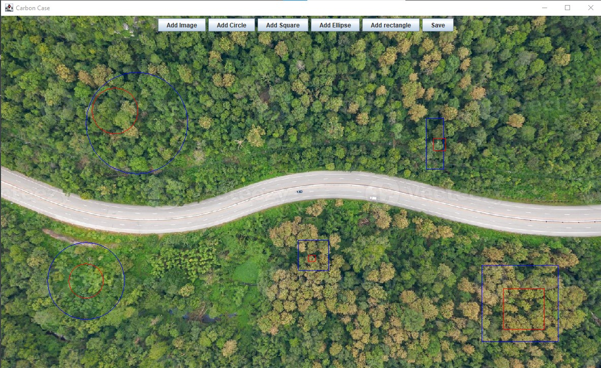
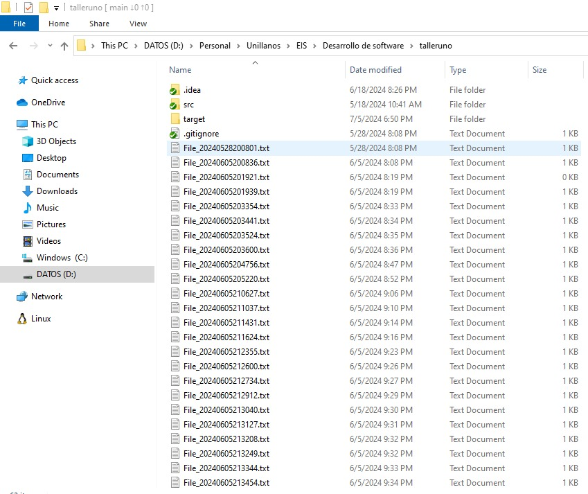
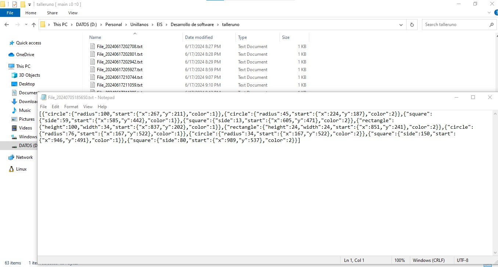
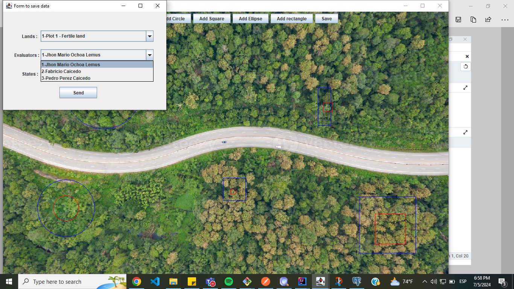
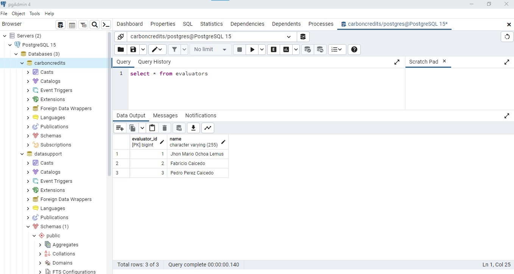

# Talleres del Curso: Desarrollo de Software 1

## Caso 1: Aplicación de Escritorio para Cálculo de Áreas de Bosque

### Descripción
Este taller consiste en el desarrollo de una aplicación de escritorio en Java. La aplicación permite marcar lugares específicos en una imagen utilizando figuras geométricas con el objetivo de calcular las áreas de bosque en el territorio asignado.

### Características Principales
- Utiliza Java para la lógica de la aplicación.
- Permite cargar una imagen del territorio.
- Permite marcar áreas de interés con figuras geométricas (por ejemplo, rectángulos, círculos).
- Calcula y muestra las áreas de bosque basadas en las figuras marcadas en la imagen.

### Funcionalidades
- Cargar una imagen del territorio.
- Seleccionar y dibujar figuras geométricas para marcar áreas de bosque.
- Calcular las áreas marcadas y guardar los resultados.

## Uso del Repositorio
Este repositorio contiene el código fuente y recursos necesarios para la ejecución y desarrollo de la aplicación de escritorio en Java.

## Caso 2: Servicios Web para Gestión de Información

### Descripción
Este taller se enfoca en la implementación de servicios web para la gestión de información generada por la aplicación de escritorio desarrollada en el Caso 1. Los servicios web permiten almacenar y gestionar datos relacionados con las áreas de bosque evaluadas.

### Características Principales
- Implementa servicios web utilizando tecnologías Java.
- Permite la comunicación entre la aplicación de escritorio y una base de datos.

## Uso del Repositorio
Este repositorio contiene el código fuente y documentación necesaria para el desarrollo y despliegue de los servicios web en Java, así como para la integración con la aplicación de escritorio del Caso 1.

